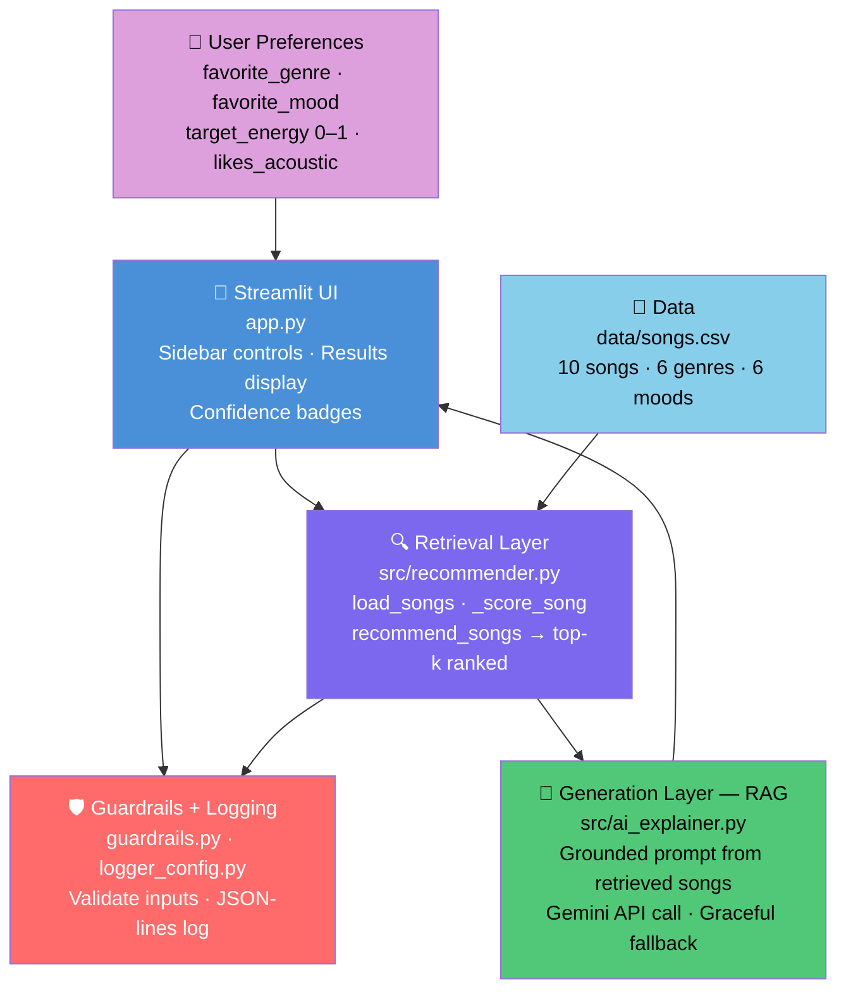

# VibeFinder — AI Music Recommender

**Base project:** Music Recommender Simulation (Module 3)

The original project scaffolded a rule-based music recommender with `Song` and `UserProfile` dataclasses and stub functions for loading songs, scoring, and generating explanations. This final project fully implements and extends that system into a complete applied AI application featuring a Streamlit UI, Gemini API RAG integration, structured logging, input guardrails, and a 7-test automated test suite.

---

## Demo Walkthrough

> **Loom video:** *(add your walkthrough link here)*

---

## System Architecture



*Diagram source: [assets/architecture.mmd](assets/architecture.mmd)*

**AI Feature: Retrieval-Augmented Generation (RAG)**
1. **Retrieval** — the recommender scores all 10 songs using a weighted feature match (genre 35%, mood 30%, energy proximity 25%, acousticness 10%) and returns the top-k matches.
2. **Generation** — the retrieved song data is injected into a Gemini prompt, which writes a natural language explanation grounded only in those songs. Gemini cannot hallucinate titles or attributes because all data comes from the retrieval step.

---

## How the System Works

Each `Song` has: title, artist, genre, mood, energy (0–1), tempo (BPM), valence, danceability, acousticness.

Each `UserProfile` stores: favorite genre, favorite mood, target energy level (0–1), and acoustic preference.

The scoring algorithm computes a weighted sum:

| Feature | Weight | Logic |
|---|---|---|
| Genre match | 35% | 1.0 if exact match, else 0.0 |
| Mood match | 30% | 1.0 if exact match, else 0.0 |
| Energy proximity | 25% | `1.0 - abs(song_energy - target_energy)` |
| Acoustic preference | 10% | acousticness if prefers acoustic, else inverse |

Confidence labels: **High** (score ≥ 0.7) · **Medium** (≥ 0.45) · **Low** (< 0.45).

---

## Getting Started

### Prerequisites

- Python 3.9+
- A Gemini API key (optional — the app works without one; AI explanations are disabled gracefully)

### Setup

1. Clone the repository and enter the folder.

2. Create a virtual environment (recommended):

   ```bash
   python -m venv .venv
   source .venv/bin/activate      # Mac/Linux
   .venv\Scripts\activate         # Windows
   ```

3. Install dependencies:

   ```bash
   pip install -r requirements.txt
   ```

4. (Optional) Create a `.env` file in the project root to enable Gemini AI explanations:

   ```
   GEMINI_API_KEY=your_key_here
   ```

   Get a free key at [aistudio.google.com](https://aistudio.google.com).

### Running the Streamlit UI

```bash
streamlit run app.py
```

Open the browser URL shown in the terminal. Use the sidebar to set your preferences and click **Find My Songs**.

### Running the CLI

```bash
python -m src.main
```

### Running Tests

```bash
pytest
```

All 7 tests pass without an API key.

---

## Sample Interactions

**Interaction 1 — Pop / Happy / High Energy**

Input: genre=pop, mood=happy, energy=0.85, likes_acoustic=False

```
#1 Sunrise City by Neon Echo — Score: 0.98
[Confidence: High] Matches your favorite genre (pop); fits your 'happy' mood; has very close energy to your target.

#2 Gym Hero by Max Pulse — Score: 0.66
[Confidence: Medium] Matches your favorite genre (pop); has similar energy to your target.
```

Gemini's take: *"These selections were curated with your upbeat, high-energy pop taste in mind. Sunrise City by Neon Echo is a near-perfect match — its pop genre, happy mood, and 0.93 energy align almost exactly with your preferences..."*

---

**Interaction 2 — Lofi / Chill / Low Energy / Acoustic**

Input: genre=lofi, mood=chill, energy=0.35, likes_acoustic=True

```
#1 Library Rain by LoRoom — Score: 0.93
[Confidence: High] Matches your favorite genre (lofi); fits your 'chill' mood; has very close energy to your target.

#2 Midnight Coding by LoRoom — Score: 0.81
[Confidence: High] Matches your favorite genre (lofi); fits your 'chill' mood; has similar energy to your target.
```

Gemini's take: *"Both picks lean into your love of calm, acoustic lofi textures. Library Rain's acousticness of 0.86 and relaxed energy of 0.35 make it a natural match..."*

---

**Interaction 3 — Ambient / Relaxed (mood surfaces cross-genre matches)**

Input: genre=ambient, mood=relaxed, energy=0.3, likes_acoustic=True

```
#1 Desert Frequencies by Terra Sound — Score: 0.88
[Confidence: High] Matches your favorite genre (ambient); fits your 'relaxed' mood; has very close energy to your target.

#2 Library Rain by LoRoom — Score: 0.46
[Confidence: Medium] Fits your 'relaxed' mood; has very close energy to your target.
```

This shows how the 30% mood weight surfaces cross-genre results when no genre match exists.

---

## Design Decisions

- **Weighted scoring instead of ML model:** A transparent formula makes confidence scores interpretable and requires no training data or external APIs beyond what's in the CSV.
- **RAG over pure generation:** Injecting retrieved song data into the prompt prevents Gemini from hallucinating song titles or inventing musical features.
- **One Gemini call for all results:** A single paragraph about the whole playlist is more coherent and cheaper than per-song calls.
- **Graceful degradation:** If no API key is set, all rule-based features still work. The app never crashes due to a missing key.

---

## Testing Summary

7 automated tests cover: sorted recommendation output, correct k-limiting, `load_songs` structure validation, score ordering, guardrail rejection of out-of-range energy, and confidence label presence in explanations. **7/7 pass.**

The system struggled with cross-genre recommendations — if a user's favorite genre has no match in the catalog, scores stay low even with good mood/energy alignment. Partial genre credit (e.g., treating "indie pop" and "pop" as 60% similar) would improve this.

---

## Reflection

Building this system clarified how much recommender "intelligence" is really just engineered feature weights. The scoring algorithm makes every decision explicit and auditable — unlike a neural recommendation model where the reasoning is opaque. The RAG integration demonstrated why grounding AI generation in retrieved data matters: without injecting actual song attributes into the prompt, Gemini could plausibly make up details.

A real production system would need collaborative filtering, much larger catalogs, and careful fairness audits to avoid over-representing popular genres at the expense of niche tastes.

---

*See [model_card.md](model_card.md) for full reflection and bias analysis.*
